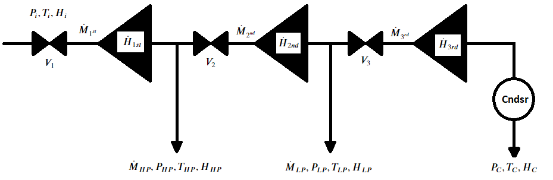

# Double Extraction Condensing Turbine Digital Twin
SLSP-based turbine behavoiral model with adjustable extraction/genration priorities derived from first principles and adapatable to any turbine of this type given the extraction curves to calculate section flow limits.

